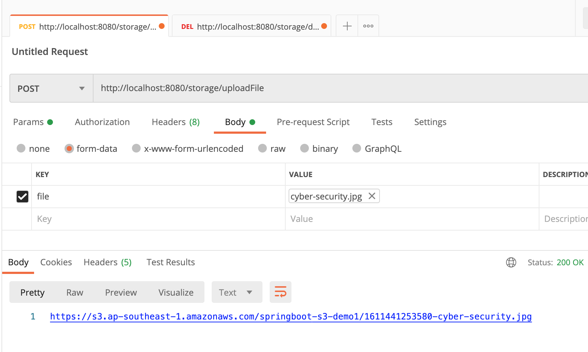
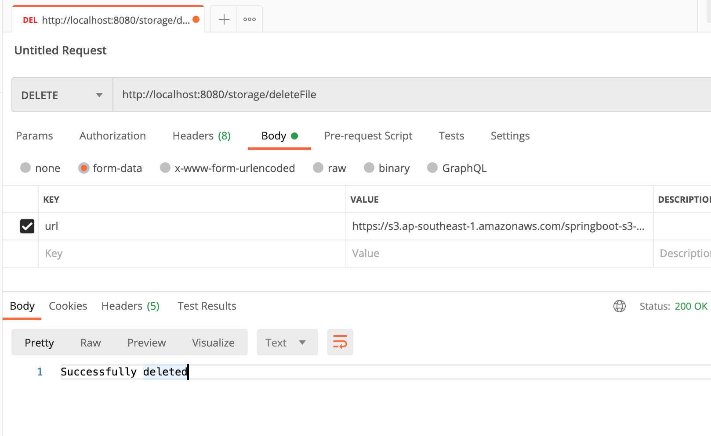
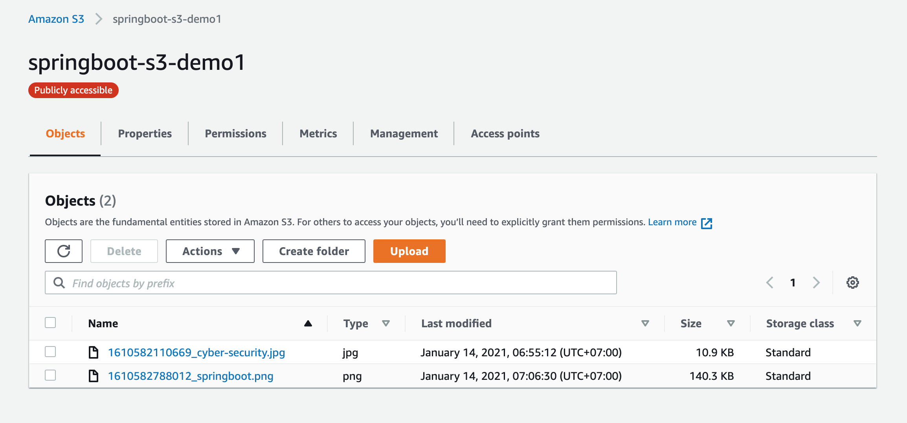

# SpringBootS3Bucket

# spring-boot-thymeleaf-aws-s3

### Things to do list:

1. Clone this repository: `git clone https://github.com/hendisantika/SpringBootS3Bucket.git`
2. Go inside the folder: `cd SpringBootS3Bucket`
3. Change AWS Access Key & Secret Key in application.yml
4. Run the application: `mvn clean spring-boot:run`
5. Add policy statement:

```json
{
  "Id": "Policy1611359479753",
  "Version": "2012-10-17",
  "Statement": [
    {
      "Sid": "Stmt1611359470980",
      "Action": [
        "s3:DeleteObject",
        "s3:GetObject",
        "s3:PutObject"
      ],
      "Effect": "Allow",
      "Resource": "arn:aws:s3:::springboot-s3-demo1/*",
      "Principal": "*"
    }
  ]
}
```

### Images Screen shot

Upload File



Delete File



AWS S3 Files



